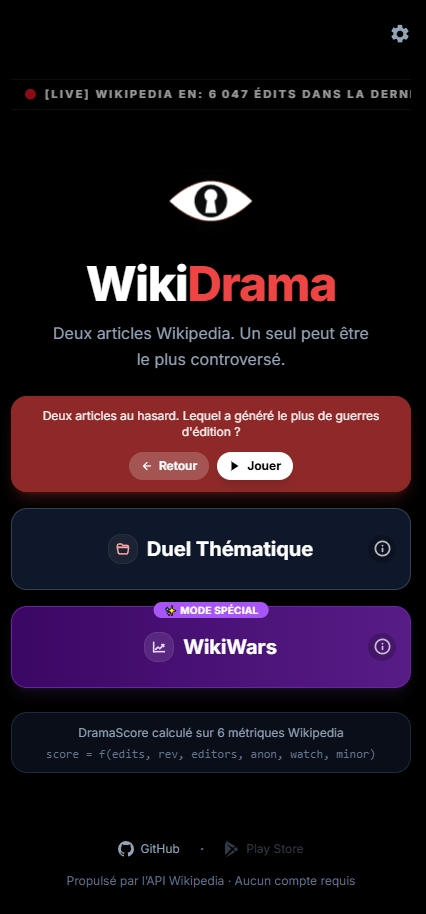
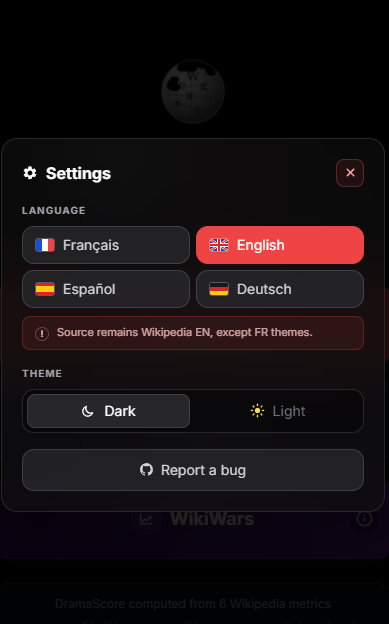


# WikiDrama

> Two Wikipedia articles. Only one can be the most controversial, or the most read.

**WikiDrama** is a mobile-first React app that turns Wikipedia edit wars and pageview data into quick duel games. It includes the classic **Drama Score** mode, a themed duel mode, and **WikiWars**, a special mode based on Wikimedia pageviews.

<p align="center">
  
  
</p>

[](https://wikidrama.pages.dev)
[]()
[]()

---

## Latest Updates

- **Animated WikiDrama logo** — minimalist "Eye & Keyhole" vector design. The keyhole glows red interactively upon hover or tap during gameplay. Respects `prefers-reduced-motion`.
- **Full SVG icon system** — all emoji icons replaced with crisp inline SVGs across the entire UI: category picker, settings modal (flags, gear, theme toggles, close button), home mode buttons, and duel headers.
- **Simplified CategoryPicker** — tap-to-play flow replaces the previous select-then-play pattern for faster navigation.
- **Live drama ticker** on the home screen with current Wikipedia edit/pageview signals.
- **Settings source notice** clarifying that interface language does not change the data source: Wikipedia EN remains the source except for FR themes.
- **FR/EN/ES/DE interface translations** with localized labels for settings, categories, share text, WikiWars, and the live ticker.
- **Dark/light theme support** through semantic Tailwind tokens.
- **Focus-trapped modals** for Settings and sharing flows.

---

## Game Modes

### Random Duel

Two Wikipedia articles are drawn at random from a pool of 500+ controversial topics. Guess which one generated the most controversy.

### Thematic Duel

Pick a category and compare two articles from the same universe. Categories include Politics, Sport, Pop Culture, Science, History, Religion, Tech, French YouTubers, and US YouTubers.

### WikiWars

Forget the drama: guess which article got the most Wikipedia views over the last 12 months using the Wikimedia Pageviews API.

---

## Drama Score

Drama Score is computed from six public Wikipedia/XTools metrics:

| Metric | Source | Weight |
|---|---|---|
| Total edit count | XTools | High |
| Reversion rate | Wikipedia API | High |
| Unique editors | XTools | Medium |
| Anonymous edit rate | XTools | Medium |
| Watcher count | XTools | Medium |
| Minor edit rate | XTools | Low |

```txt
score = f(edits, rev, editors, anon, watch, minor)
```

Tiers: **Legendary** > **Enormous Drama** > **Total Chaos** > **Agitated** > **Disputed** > **Calm** > **No drama**.

---

## WikiWars Tiers

| Tier | Views / 12 months |
|---|---|
| Viral | > 5M |
| Worldwide | 1M-5M |
| Trending | 500k-1M |
| Popular | 100k-500k |
| Known | 20k-100k |
| Obscure | < 20k |

---

## Data Sources

- **Wikipedia REST API** for article summaries and revision data.
- **Wikipedia Action API** for revision and protection checks.
- **XTools API** for aggregate article stats such as total revisions, editors, anonymous edits, minor edits, and watchers.
- **Wikimedia Pageviews API** for WikiWars 12-month views and the live ticker top-article signal.

The app is frontend-only and uses public APIs with no account or backend required. Most data comes from Wikipedia EN; FR-themed categories can use Wikipedia FR.

---

## Stack

- React 18 + TypeScript
- Vite
- Tailwind CSS
- i18next / react-i18next
- React Router
- Cloudflare Pages

---

## Run Locally

```bash
git clone https://github.com/okash99/wikidrama
cd wikidrama
npm install
npm run dev
```

Build:

```bash
npm run build
```

---

## Roadmap

- [x] FR/EN/ES/DE interface localization
- [x] Dark/light theme system
- [x] Glassmorphism UI pass with semantic colors
- [x] Mobile viewport and accessibility fixes
- [x] Live home ticker
- [x] Settings notice for Wikipedia source behavior
- [x] SVG icon system (emoji-free UI)
- [x] Animated interactive logo
- [ ] Streak counter
- [ ] Thematic WikiWars mode
- [ ] User accounts and saved scores
- [ ] Expanded live feed for ongoing edit wars

---

*WikiDrama V3 - Powered by public Wikipedia, Wikimedia, and XTools APIs.*
