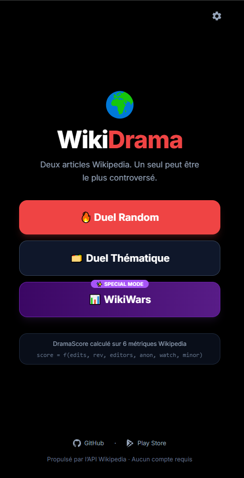

# WikiDrama

> Two Wikipedia articles. Only one can be the most controversial, or the most read.

WikiDrama is a mobile-first React app that turns Wikipedia edit wars and pageview data into quick duel games. It includes the classic Drama Score mode, a thematic duel mode, and WikiWars, a special mode based on Wikimedia pageviews.

<p align="center">
  
</p>

[Live demo](https://wikidrama.pages.dev)

## Game Modes

### Random Duel

Two Wikipedia articles are drawn at random from a pool of controversial topics. Guess which one generated the most controversy.

### Thematic Duel

Pick a category and compare two articles from the same universe. Current categories include Politics, Sport, Pop Culture, Science, History, Religion, Tech, French YouTubers, US YouTubers, and Miscellaneous.

### WikiWars

Forget the drama: guess which article got the most Wikipedia views over the last 12 months using the Wikimedia Pageviews API.

## Drama Score

Drama Score is computed from six public Wikipedia and XTools metrics:

| Metric | Source | Weight |
|---|---|---|
| Total edit count | XTools | High |
| Reversion rate | Wikipedia API | High |
| Unique editors | XTools | Medium |
| Anonymous edit rate | XTools | Medium |
| Watcher count | XTools | Medium |
| Minor edit rate | XTools | Low |

```txt
score = f(edits, rev, editors, anon, watch, minor)
```

Tiers: Legendary > Enormous Drama > Total Chaos > Agitated > Disputed > Calm > No drama.

## WikiWars Tiers

| Tier | Views / 12 months |
|---|---|
| Viral | > 5M |
| Worldwide | 1M-5M |
| Trending | 500k-1M |
| Popular | 100k-500k |
| Known | 20k-100k |
| Obscure | < 20k |

## Data Sources

- Wikipedia REST API for article summaries and thumbnails
- Wikipedia Action API for revision and protection checks
- XTools API for aggregate article stats such as revisions, editors, anonymous edits, minor edits, and watchers
- Wikimedia Pageviews API for WikiWars 12-month views and the live ticker

The app is frontend-only and uses public APIs with no account or backend required. Most data comes from Wikipedia EN, while FR-themed categories can use Wikipedia FR.

## Stack

- React 18 + TypeScript
- Vite
- Tailwind CSS
- i18next / react-i18next
- React Router
- Cloudflare Pages

## Run Locally

```bash
git clone https://github.com/okash99/wikidrama
cd wikidrama
npm install
npm run dev
```

Build:

```bash
npm run build
```

## Roadmap

- [x] FR/EN/ES/DE interface localization
- [x] Dark/light theme system
- [x] Mobile viewport and accessibility fixes
- [x] Live home ticker
- [x] Settings notice for Wikipedia source behavior
- [x] Animated interactive logo
- [x] Sudden Death mode
- [ ] Streak counter / Local stats
- [ ] Quest and xp system
- [ ] User accounts and saved scores with ladder
- [ ] Enrich the live feed with more metrics
- [ ] ADD MORE ARTICLES AND THEMES ! + Refine formula - Add talkPAGE Sentiment score to the DramaScore formula


WikiDrama V3 is powered by public Wikipedia, Wikimedia, and XTools APIs.
